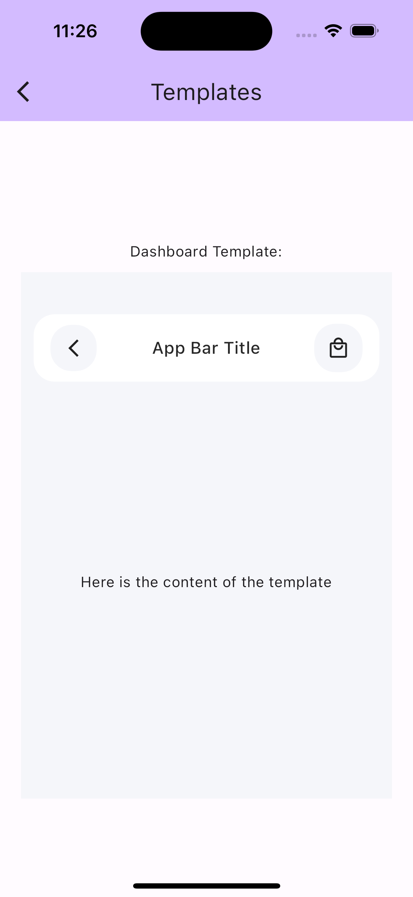

# Atomic Flutter Package Example

This example demonstrates the usage of the Atomic Flutter Package, showcasing various components categorized by Atomic Design principles.

## Overview

Atomic design is a methodology for creating design systems by breaking UI elements into fundamental components. This example organizes components into five levels:

- **Atoms**: Basic UI elements.
- **Molecules**: Groups of atoms functioning together.
- **Organisms**: Compositions of molecules that form distinct sections of an interface.
- **Templates**: Complete layouts or pages.
- **Pages**: Specific instances of templates, representing full user interfaces.

## Components

### Atoms Page
Displays basic UI elements like `SkeletonWidget`, `IconButtonWidget`, and `ChipWidget`.

### Molecules Page
Shows groups of atoms working together, including `DetailCard` and `ChipsCarousel`.

### Organism Page
Features higher-level components composed of molecules and atoms, such as `CardsGrid`, `CustomAppBar`, and `LoginForm`.

### Templates Page
Demonstrates complete layouts or templates like `DashboardTemplate`, showcasing structured UI with navigation elements.

### Pages Page
Represents specific instances of templates, such as `LoginPage`, showing full-fledged user interfaces.

## Getting Started

### Prerequisites
- Ensure you have Flutter installed. See [Flutter installation guide](https://github.com/sharfe25/atomic_flutter_package.git).

### Running the Example

1. Clone this repository:
   ```bash
   git clone https://github.com/your/repository.git
   ```

2. Navigate to the example directory:

```bash
cd connect_fake_store/example
```

3. Install dependencies:

```bash
flutter pub get
```

4. Run the example on a connected device or emulator:
```bash
flutter run
```

5. Explore the example.

## Screenshots
{height=200px}
{height=200px}
{height=200px}
{height=200px}
{height=200px}
{height=200px}

## License
This example is licensed under the MIT License. See the [LICENSE] (https://choosealicense.com/licenses/mit/) file for more details.

